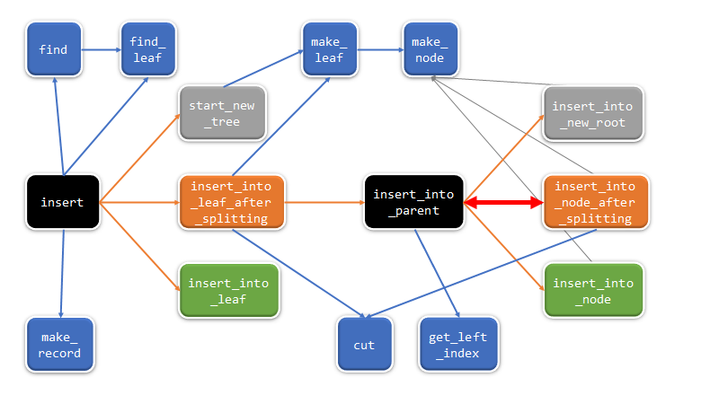
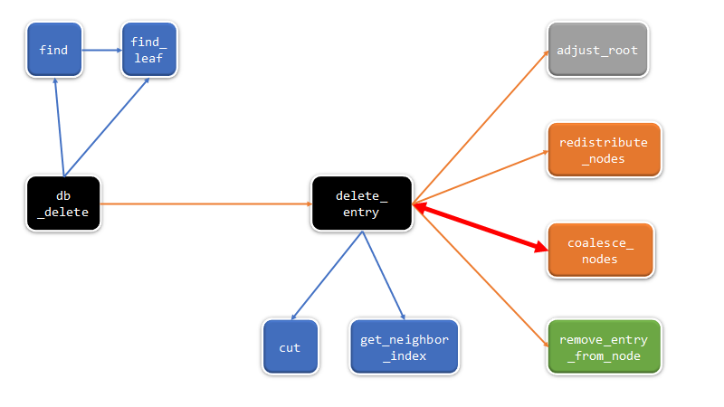

# Analysis of in-memory B+ tree
## Node data structure and modification
---
```
-leaf node-
pointers [2*D + 1] (point to records)
keys [2*D]
parent
is_leaf
num_keys
next (not used in find, insert, delete)
```
```
-internal node-
pointers [2*D + 1] (point to node)
keys [2*D]
parent
is_leaf
num_keys
next (not used in find, insert, delete)
```
Note. in bpt code, order means different from lecture's meaning.
Let D means order of the tree in lecture.
Then order variable in bpt code equals 2*D + 1
> order = 2*D + 1

So, order equals max fan-out in lecture.
 
**From now on, order of the tree means D (in lecture meaning) not order variable in code.**

Then, Occupancy Invariant in this tree is as follows
> D <= (the number of entries) <= 2*D

In leaf node, it stores record pointers array and keys array.
It stores up to 2*D keys and record pointers and right leaf pointer.
Right leaf node's pointer is stored in last pointer in array.
If the node is rightmost node in the tree, then that pointer value is NULL(0).

In internal node, it stores node pointers array and keys array.
It stores up to 2\*D keys and 2\*D + 1 record pointers.
Records whose key value is lower than key[0] are stored in pointer[0]'s node.
For all i(0<=i<(number of the key)), Records whose key value is greater than and equal to key[i] and is lower than key[i+1] are stored in pointer[i+1]'s node.
Records whose key value is greater than and equal to last key are stored in last pointer's node.
It is same as Key Invariant. Also, the number of pointers in internal node is greater than the number of keys by 1.
> Let, [P_0, K_0, P_1, K_1, ..., K_n, P_n+1]
>
> records(K_i <= key value < K_(i+1)) is stored in P_(i+1)
>
> (number of pointers) = (number of keys) + 1

parent, is_leaf, num_keys means same in both type of nodes. next doesn't use in our project's api, so we can ignore this field.

By paginated architecture in disk-based B+ tree, all member variables in node structure stored in certain field in page.
We can store parent, is_leaf, num_keys in same field in page header in both type of page.

Because leaf page is slotted page, we store slot(key + size + in-page offset) instead of keys arrays at front part of page body contiguously. Records are stored at end of page reversely instead of using pointers array. Right leaf page pointer(Special pointer) stored in page header. As we use slotted page architecture, we have to store additional information in page header such as amount of free space.

In internal page, we store key and page number(instead of pointer) in page body alternately instead of using two arrays. In page body, we store these values structured like [K_0, P_1, K_1, ..., K_n, P_n+1]. We can store P_0(Special pointer) in page header.

In such way, we can store dynamic node structure in static page space.

---
## Possible call path of the insert/delete operation and detail flow of the structure modification (split, merge)
---

###### Fig1. insert call graph flow

###### Fig2. delete call graph flow

```
blue box: find or utility function
black box: master function or recursion(branch) part function
grey box: function related to root's content 
green box: function in no invariant violation situation(no split, merge, and redistribute)
orange box: function in invariant violation (need to split, merge, or redistribute)

blue and grey arrow: call function just to use its feature(find, make, cut,...)
orange arrow: main call path(branch or state movement)
red arrow: bi-directional call path(recursion call occurred)
```
---

### Blue box(utility function) spec
---

Note. This is not full spec ignoring minors (i.e. verbose)

find_leaf(root, key): find leaf node that is likely to contain given key

find(root, key): find corresponding leaf node by calling find_leaf and find record to which key refers

cut(length): calculate length(D) with 2*length(D) + 1 to get split or merge threshold etc. we don't have to use in on-disk B+ tree instead we use constant macro.

make_record(value): make record structure with given value

make_node(): construct and init default node

make_leaf(): construct leaf node by calling make_node() and set is_leaf true

get_left_index(parent, left): find the index of "left" node in parent node 

get_neighbor_index(n): find the index of "n"'s left sibling node in "n"'s parent node (return -1, if "n" is leftmost child)

---

### insert
---

First we call insert(node, key, value). If there is given key in tree already, stop insert by call find(ignore duplicates).
Create record pointer by call make_record and the insert process proceeds according to **three situations**.

1. tree doesn't exist -> call start_new_tree(key, record pointer(a.k.a pointer))
2. corresponding leaf has room for key and pointer (no invariant violation) -> call insert_into_leaf(corresponding leaf node(a.k.a leaf), key, pointer)
3. no room for new record in leaf (invariant violation, need split) -> call insert_into_leaf_after_splitting(root, leaf, key, pointer)

In first situation, construct new tree root by call make_leaf and insert given key, pointer in new root.

In second situation, insert given key, pointer into given leaf in right position to remain order.

In third situation, make new leaf by call make_leaf and split 2*D+1 keys and pointers in half(using cut function) and store them in given leaf and new leaf. Set new leaf as given leaf's right leaf and call insert_into_parent(root, leaf, new_leaf's first key(a.k.a. new_key), new_leaf).

After splitting leaf(inserting new record in one of two leaves), we need to insert new leaf's key and new leaf pointer into their parent node. This insert process proceeds according to **three situations again**.

1. No parent. Needs to make new root -> call insert_into_new_root(leaf(a.k.a. left), new_key(a.k.a key), new_leaf(a.k.a. right))
2. parent node has room for key and pointer (no invariant violation) -> find left node's index by call get_left_index(parent, left) and call insert_into_node(root, parent, left_index, key, right)
3. no room for new key and pointer (invariant violation, need split) -> find left node's index and call insert_into_node_after_splitting(root, parent, left_index, key, right)

In first situation, construct new tree root by call make_node and insert given key, two pointers in new root.

In second situation, insert given key, pointer into given node in right position(left_index) to remain order.

In third situation, make new node by call make_node and split 2*D+1 keys and 2*D+2 pointers in half(using cut function) and store them in given node(a.k.a. old_node) and new node. In this case, don't store middle key between two nodes and set aside.  Set new node as given node's right node and call insert_into_parent(root, old_node, middle key as we set aside before (a.k.a. k_prime), new_node) to insert new key and node in parent node again.

In third situation, this call insert_into_parent again and it makes recursion. Insert process continues this loop until first or second situation occurred.

---

### delete
---

First we call delete(node, key). If there is no given key in tree, stop delete process by call find.
Find corresponding leaf node by call find_leaf and call delete_entry(root, corresponding leaf(a.k.a. key_leaf), key, corresponding record(a.k.a. key_record) to proceed delete operation.

In delete_entry function, first we remove given key and pointer from given node by call remove_entry_from_node(key_leaf(a.k.a. n), key, key_record(a.k.a. pointer))

**Unlike insertion operation, we can combine certain part(delete entry) of operation so we call remove_entry_from_node at first regardless of situation.**

In remove_entry_from_node, remove given key and pointer from given node and that's all about this function.

After remove key and pointer in the node, later part proceeds according to **four situations**.

1. No parent. Deletion occurred from the root -> call adjust_root(root)
2. given node has D(find it call by cut) or more keys. (no invariant violation) -> just return root (DONE!)
3. given node has lower than D keys and sum of two nodes' keys is greater than 2*D (invariant violation, need redistribution) -> find left node's index by call get_neighbor_index and call redistribute_nodes(root, n, left node or right node(if n is leftmost node) (a.k.a. neighbor), neighbor_index, middle key index between two nodes(a.k.a. k_prime_index), k_prime)
4. given node has lower than D keys and sum of two nodes' keys is lower than and equal to 2*D (invariant violation, need merge) -> find neighbor and middle key like third situation and call coalesce_nodes(root, n, neighbor, neighbor_index, k_prime)


In first situation, if root has key then just end deletion operation, else make first child as new root or return NULL if there is no node anymore(empty case).

In second situation, we don't need additional description. (just remove_entry_from_node)

In third situation, put neighbor's key and pointer to given node in right position to remain order. We use left neighbor's last key and pointer if there is left neighbor else we use right neighbor's first key and pointer. In addition, we modify parent's key also. For example, in internal node, put last pointer in neighbor into first pointer in given node and put middle key(k_prime) into first key in given node and put neighbor's last key into middle key position.

In fourth situation, append k_prime(if it's internal node) and all given node's keys and pointers into neighbor and delete k_prime and given node by call delete_entry(root, n's parent, k_prime, n)

In fourth situation, this call delete_entry again and it makes recursion. Delete process continues this loop until first or second or third situation occurred.


